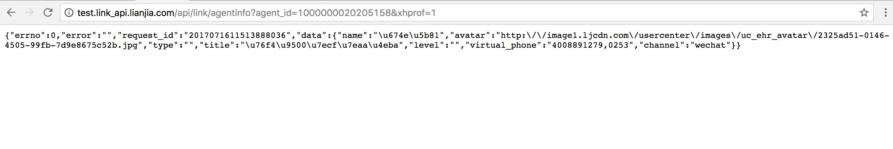
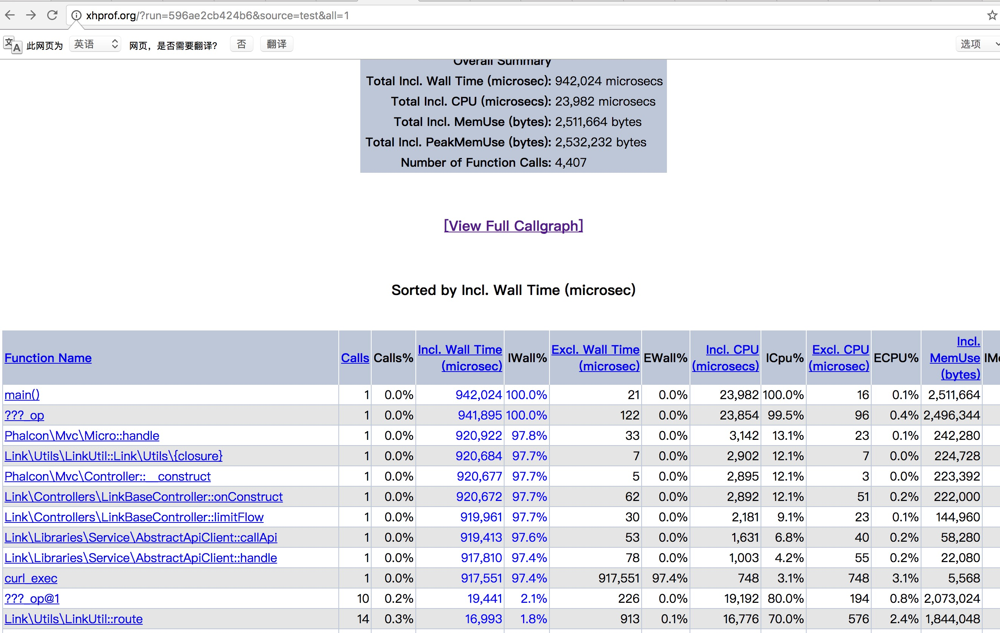
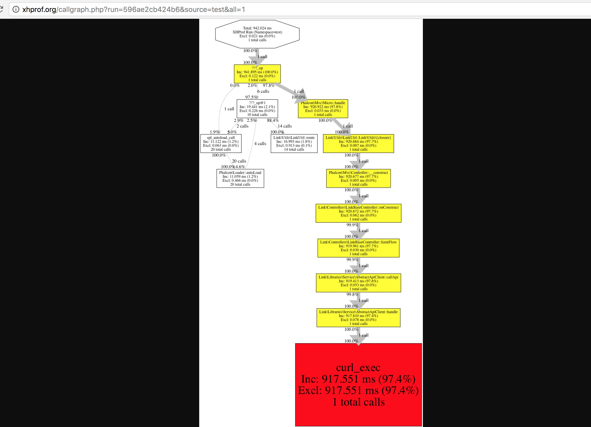

##项目中无缝接入xhprof,无需改动任何项目代码

####安装xhprof
```shell
下载
http://pecl.php.net/get/xhprof-0.9.4.tgz

解压并进入
tar -zxf xhprof-0.9.4.tgz && cd xhprof-0.9.4

编译安装
phpize
./configure
cp modules/xhprof.so  $(php-config --extension-dir)

添加扩展ini文件，可以通过php --ini 查看配置文件
touch /usr/local/etc/php/7.1/conf.d/ext-xhprof.ini
在ext-xhprof.ini文件中加入
[xhprof]
extension = "phpng_xhprof.so"
xhprof.output_dir=/tmp/xhprof
```

####配置可视化界面

```nginx

mv xhprof-0.9.4 /data0/www/xhprof

在nginx配置文件中加入

server {
    charset utf-8;
    client_max_body_size 128M;

    listen 80; ## listen for ipv4

    server_name xhprof.org;
    root        /data0/www/xhprof/xhprof_html;
    index       index.php;

    access_log  /data0/www/applogs/xhprof/access.log;
    error_log   /data0/www/applogs/xhprof/error.log;

    location / {
        try_files $uri $uri/ /index.php$is_args$args;
    }


    location ~ \.php$ {
        include fastcgi_params;
        fastcgi_param SCRIPT_FILENAME $document_root$fastcgi_script_name;
        fastcgi_pass 127.0.0.1:9000;
        #fastcgi_pass unix:/var/run/php5-fpm.sock;
        try_files $uri =404;
    }

    location ~* /\. {
        deny all;
    }
}
```

####重要的步骤来了，进入xhprof机制，设置开关，看下面代码

```
编辑vim /data0/www/xhprof/xhprof.php
其实核心就是注册一个register_shutdown_function

<?php
if (isset($_REQUEST['xhprof']) && $_REQUEST['xhprof'] = 1) {
    xhprof_enable(XHPROF_FLAGS_MEMORY | XHPROF_FLAGS_CPU);
    register_shutdown_function(function() {
        $xhprof_data = xhprof_disable();
        if (function_exists('fastcgi_finish_request')) {
            fastcgi_finish_request();
        }
        include_once "/data0/www/xhprof/xhprof_lib/utils/xhprof_lib.php";
        include_once "/data0/www/xhprof/xhprof_lib/utils/xhprof_runs.php";
        $xhprof_runs = new XHProfRuns_Default();
        $run_id = $xhprof_runs->save_run($xhprof_data, 'test');
        file_put_contents('/data0/www/xhprof/xhprof.txt', 'http://xhprof.org/index.php?run=' . $run_id . '&source=test'.'\n');
    });
}

然后在配置文件加入 /usr/local/etc/php/7.1/conf.d/ext-xhprof.ini
指令
auto_prepend_file='/data0/www/xhprof/xhprof.php' //重点就在这，一个请求生命周期开始的时候会自动引入这个文件，我们只需在参数后面加上xhprof=1 即可！

```

####看一看最终效果，verygood




