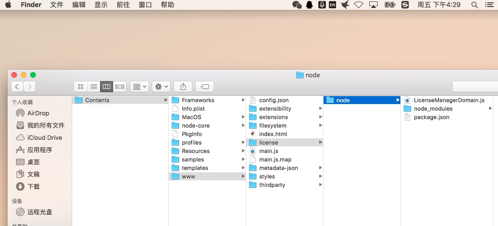
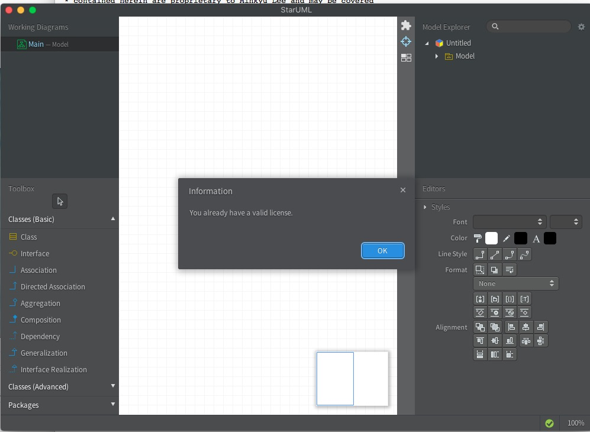

##工具篇

starUML工具破解

下载工具: http://staruml.io/

###1. 下载后安装找到下面文件打开


###2. 将其中代码改为如下:

```javascript
var NodeRSA = require('node-rsa');
    
    function validate(PK, name, product, licenseKey) {
        var pk, decrypted;
        return {
            name: "0xcb",
            product: "StarUML",
            licenseType: "vip",
            quantity: "bbs.chinapyg.com",
            licenseKey: "later equals never!"
        };
        try {
            pk = new NodeRSA(PK);
            decrypted = pk.decrypt(licenseKey, 'utf8');
        } catch (err) {
            return false;
        }
        var terms = decrypted.trim().split("\n");
        if (terms[0] === name && terms[1] === product) {
            return { 
                name: name, 
                product: product, 
                licenseType: terms[2],
                quantity: terms[3],
                licenseKey: licenseKey
            };
        } else {
            return false;
        }
    }

```

###3. 激活

    打开StarUML -> Help -> Enter License

    输入：Name:0xbc

    licenseKey:later equals never!

    Enter! Enjoy!

###4. 最终效果


